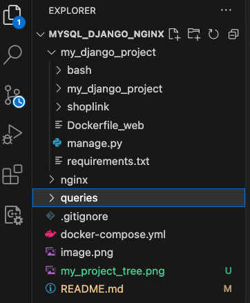
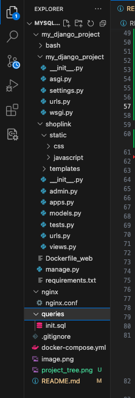

<p align="center">
  
</p>

### About this Django project
<h3 style="color:red; border:2px solid black" >0- my_django_project </h3>
<p>Please, make sure you have django installed and also i recommand to use virtualenv</p>

```
command: django-admin startproject my_django_project
```
  
<pre>
my_django_project/
    manage.py
    my_django_project/
        __init__.py
        settings.py
        urls.py
        asgi.py
        wsgi.py
</pre>

You can test by running:
```
Command: python manage.py runserver
```
If everything goes well, you will see:
<pre>
Django version x.x, using settings 'my_djang_project.settings'
Starting development server at http://127.0.0.1:8000/
Quit the server with CONTROL-C.
</pre>

### About This Django project' Apllication

<h3 style="color:red; border:2px solid black" >1- my applicaion inside this django project </h3>
<p>I have only one simple application called <span style="color:blue">shoplink</span>:<span style="color:#abcd">It consists of displaying The content of tables inside Mysql instanciated container</span></p>

inside the same directory as manage.py and type this command
```
command: python manage.py startapp shoplink
```
<pre>
shoplink/
    __init__.py
    admin.py
    apps.py
    migrations/
        __init__.py
    models.py
    tests.py
    views.py
</pre>
<h4>Here is the project tree:</h4>
<p align="center">
  
</p>

<h4>And the tree with directories files</h4>
<p align="center">
  
</p>

<h3 style="color:red; border:2px solid black" >2- Services Inside Docker Compose </h3>

```
version: '3'

services:

  # Mysql Service
  db:
  ...

  # Web (Django) Service
  web:
  ...

  # Nginx Service
  nginx:
  ...
```
### About Used Services
<h3 style="color:red; border:1px solid black" >I- Mysql (db service) </h3>
<p style="color:grey">We use the latest image. We want our tables to be created once container is running so we shared our sql file(s) <span style="color:blue">./queries/init.sql</span> (inside host) with <span style="color:blue">/docker-entrypoint-initdb.d/init.sql</span> inside container.
By doing so, all the queries inside sql files will be automatically executed, just after the container is ready. Please, see Docker-compose.yml file.</p>

<br/>

<h3 style="color:red; border:1px solid black" >2- Dango (web service) </h3>
<p>This service must start after the first service (db service is ready), so we ned to add shell script <span style="color:blue">wait-for-it.sh </span>inside command attribute. Inside the same command attribute, we run collectstatic so that django collect all static files from all application (here i have only onecalled shoplink) into a folder we state here: STATIC_ROOT = os.path.join(BASE_DIR, 'staticfiles') in settings.py file </p>

<br/>

<h3 style="color:red; border:1px solid black" >3- Nginx (web service) </h3>
<p>
I want Nginx to serve static files, templates and to behave as reverse proxy(aka to receive http request and to redirect them towards django server)
<span style="color:blue">To do that, i need to share frm host to nginx container</span>:

<ol>
<li> configuration file:&nbsp; <span style="color:orange">./nginx:/etc/nginx/conf.d</span></li>
<li>static directory:&nbsp; <span style="color:orange">- ./my_django_project/shoplink/static:/static</span>
<ol><li>css</li><li>javascript</li></ol>
</li>
<li>templates directory:&nbsp; <span style="color:orange"> - ./my_django_project/shoplink/templates:/usr/share/nginx/html/templates</span>
<ol><li>table_buyers_template.html</li><li>table_senders_template.html</li></ol>
</li>
</ol>
</p>

My nginx configuration file called: ./nginx/nginx.conf is aff follow:

```
server {
    listen 80;
    server_name localhost;

    location /static/ {
        alias /static/;  # Chemin absolu vers vos fichiers statiques
    }

    location /templates/ {
        alias /usr/share/nginx/html/templates;  # Chemin absolu vers vos modèles Django
    }

    location / {
        proxy_pass http://web:8000;  # Utilisez le même port que votre service Django
        proxy_set_header Host $host;
        proxy_set_header X-Real-IP $remote_addr;
    }

    location /sellers {
        proxy_pass http://web:8000/shop/sellers;  # Assurez-vous d'inclure le port
        proxy_set_header Host $host;
        proxy_set_header X-Real-IP $remote_addr;
    }

    location /buyers {
        proxy_pass http://web:8000/shop/buyers;  # Assurez-vous d'inclure le port
        proxy_set_header Host $host;
        proxy_set_header X-Real-IP $remote_addr;
    }

}
```

<h3 style="color:red">4- HOW TO RUN</h3>
You can use docker-compose up -d  to run.

but I have many others containers for others projects, i use my bult-in  command (see below) to clean all before and run:

```
docker-compose down | docker ps -a | grep django | awk '{print $1}' | xargs docker rm -f && docker-compose down -v   && docker-compose up
```

You can find more information in my article: https://medium.com/@ibrahimadev77/using-docker-compose-to-deploy-a-web-stack-with-mysql-django-nginx-b6c4222fdce0

If you're interested in BIG DATA, here's another article I wrote: https://medium.com/@ibrahimadev77/installing-hadoop-spark-and-hive-locally-46caf5e41913

Thanks!